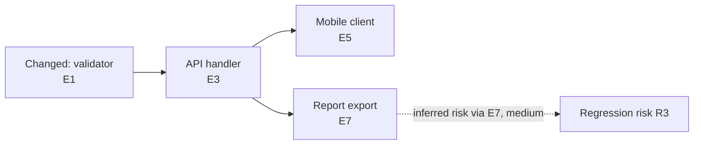

# QA Plan Generator

Generate audit-grade QA plans from real code changes. The plan must be evidence-first and graph-aware: every risk, test case, regression, caveat, diagram edge, fix recommendation, and exit criterion traces back to verified source context or is explicitly marked as a low-confidence inference.

## Use Cases

- Bug fix QA: prove the fixed behavior and likely regressions are covered.
- Feature QA: cover the changed behavior, direct consumers, indirect consumers, and release smoke path.
- PR or branch review: turn code diff + project context into an executable QA plan.
- Module audit: focus on a directory or feature area while still tracing adjacent impact.
- Release readiness: consolidate a larger diff into the highest-risk areas and clear exit criteria.
- Adversarial review: challenge the draft QA plan for missing consumers, unsupported graph edges, weak evidence, and under-tested risks.

## Input Modes

Detect input in this order:

1. **PR number**: starts with `#` or is numeric, for example `/qa-plan #419`.
2. **Branch name**: `git rev-parse --verify <arg>` succeeds.
3. **Module/directory**: path exists in the project.
4. **Freeform**: search project files/modules for the phrase.
5. **No args**: use staged + unstaged changes versus `HEAD`, then fall back to branch diff versus default branch.

If no diff, matching module, or meaningful comparison exists, stop with: `No changes detected. Specify a branch, module, PR number, or release comparison.`

## Non-Negotiables

- Verify source before writing tests. Use `rg -n`, `git diff`, `git log`, `nl -ba`, and project-native search instead of guessing.
- Every test case must cite verified evidence: `path:line`, a named architecture constraint, or a setup prerequisite discovered from the repo.
- Do not invent file:line references. If a consumer cannot be verified, mark it as an inference with `Confidence = low`.
- Do not include generic QA cases unless they are tied to a changed area, known project hotspot, or dependency trace.
- Prefer project terminology over framework examples. Infer the stack from repo files when docs are absent.
- Keep conditional sections conditional. Security, multi-tenant, offline, sync, performance, and migration checks only appear when evidence warrants them.
- Build a global-enough context graph, not an exhaustive repo transcript. Prefer indexes, dependency edges, entrypoints, and ownership boundaries over reading every file.
- Do not silently fix the target repo. Produce a `Fix Queue` with evidence and recommended action; only mutate code if the user explicitly asks for fix implementation after the QA plan.

## Workflow

### Step 1: Gather Changes

Detect the default branch:

```bash
DEFAULT_BRANCH=$(git symbolic-ref refs/remotes/origin/HEAD 2>/dev/null | sed 's@^refs/remotes/origin/@@') || DEFAULT_BRANCH="main"
```

Collect raw changes. For no-arg mode, do not combine working-tree and branch diffs:

```bash
# Default/no args
git diff HEAD
git ls-files --others --exclude-standard

# Branch
git diff ${DEFAULT_BRANCH}...<branch-name>

# PR
gh pr diff <number>

# Module
git diff ${DEFAULT_BRANCH}...HEAD -- '<module>/**'
```

If no-arg working-tree changes or untracked files exist, use only that working-tree evidence. If the working tree is clean, then use `git diff ${DEFAULT_BRANCH}...HEAD` as the fallback comparison. Never merge both result sets into one QA scope unless the user explicitly asks for full branch-plus-working-tree coverage.

For PR input, also read the PR title/body if `gh` is available. If `gh` is missing, use the local branch diff and state the limitation in `Analysis Caveats`.

Build a change inventory:

```text
CHANGE INVENTORY
Files changed:
Symbols/functions changed:
Models/types/schemas changed:
API or UI contract changes:
Validation/error handling changes:
Query/filter/permission changes:
State, event, signal, job, or workflow changes:
Existing tests touched or likely relevant:
Root cause or product motivation:
```

If root cause or motivation cannot be inferred from commits, PR text, or nearby code, set motivation to `not found in available evidence`, add an `Analysis Caveat`, and continue. Ask the user only when the missing motivation would materially change scope, risk scoring, or required environments.

### Step 2: Build The Evidence Ledger

Before generating any test case, create an evidence ledger and include it in every final QA plan. Small plans may have a short ledger, but they still need the table so every risk and test can trace to verified evidence.

```markdown
## Evidence Ledger

| Evidence ID | Source | Verified Fact | Used For | Confidence |
| ----------- | ------ | ------------- | -------- | ---------- |
| E1 | `path/file.ts:42` | Route validates org membership before loading record | Security risk, P0 auth test | high |
```

Evidence rules:

- `Source` must be a verified `path:line`, doc path, command output, schema, route table, test file, or config file.
- `Verified Fact` must state what the source proves, not merely name the file.
- `Used For` links evidence to risk rows, test cases, or caveats.
- `Confidence` is `high` when verified directly, `medium` when inferred from nearby code/docs, and `low` when plausible but not fully traceable.

### Step 3: Build The Global Context Map

Gather scoped global context before tracing blast radius. The goal is to understand enough system shape to validate the changed areas and two-hop blast radius, not to summarize every file.

Default context budget:

- Read docs/manifests/configs that define architecture or test commands.
- Inspect changed files plus direct references, entrypoints, tests, and boundary files needed to prove the blast radius.
- Stop broad context gathering after roughly 25 files or 20 minutes unless the diff is release-scale, security-sensitive, or the user explicitly requests deeper audit.
- If the cap is hit, group remaining unknowns by subsystem and record them in `Analysis Caveats` instead of continuing to read the whole repo.

- root and module `CLAUDE.md`, `AGENTS.md`, README, architecture docs, release notes, and changelog entries
- package/dependency manifests: `package.json`, `pyproject.toml`, `requirements.txt`, `Gemfile`, `go.mod`, `Cargo.toml`, etc.
- route definitions, API schemas, serializers, controllers, handlers, jobs, middleware, auth policy, permission filters, and feature flags touched by the diff
- existing tests and naming conventions for changed modules

Use the strongest context source available:

- **Language indexes / LSP**: references, definitions, implementations, type hierarchy, call hierarchy, route/schema symbols. Use language servers such as TypeScript/JavaScript, Pyright, gopls, rust-analyzer, jdtls, C# Roslyn, or IDE indexes opportunistically when the environment exposes them.
- **Build/tool indexes**: `go list`, `cargo metadata`, existing framework route listings, existing OpenAPI/GraphQL schemas, test discovery, dependency manifests.
- **Search fallback**: `rg -n`, imports, function names, route paths, event names, table/model names, and test names.
- **Context scouts**: when subagents or smaller/cheaper models are available, use read-only scouts for independent slices: docs/architecture, API/routes, data model, UI/mobile consumers, tests, auth/security, background jobs, and external integrations. If scouts are unavailable, do the same passes sequentially.

Index safety rules:

- If an index or LSP is unavailable, stale, incomplete, or too expensive to start, fall back to static search and lower call-graph confidence.
- Do not run commands that install dependencies, download packages, generate clients, rewrite files, run migrations, or mutate the repo unless the user explicitly approves that action.
- Build commands used only for read-only discovery must be project-native and safe to run in the current environment; otherwise record the limitation in `Analysis Caveats`.

Create a context map:

```markdown
## Global Context Map

| Subsystem | Entrypoints | Data / State | External Boundaries | Auth / Tenant Boundary | Tests | Evidence | Confidence |
| --------- | ----------- | ------------ | ------------------- | ---------------------- | ----- | -------- | ---------- |
| Billing API | `api/billing/*` | invoices, ledger rows | Stripe webhook | org-scoped route guard | `billing/*.test.*` | E1, E2, E8 | high |
```

When docs are absent, label the context as `INFERRED` and lower confidence for architecture claims that are not directly verified.

### Step 4: Trace Blast Radius And Draw The Graphs

Trace two hops from each changed area. Use project-native search first (`rg`, type references, route maps, imports, tests). Group large diffs by feature/module before tracing.

```markdown
## Blast Radius

| Area ID | Hop | Area | Evidence | Why It Matters | Confidence |
| ------- | --- | ---- | -------- | -------------- | ---------- |
| A1 | 0 | Changed validator | E1, E2 | Accepts/rejects user input | high |
| A2 | 1 | API handler calling validator | E3 | User-facing write path | high |
| A3 | 2 | Report consuming saved output | E4 | Regression risk in summary totals | medium |
```

Hop definitions:

- **Hop 0**: changed files, schemas, config, migrations, UI, tests, or docs.
- **Hop 1**: direct callers, callees, routes, consumers, tests, jobs, signals, hooks, UI screens, service clients, serializers, and validators.
- **Hop 2**: indirect downstream readers, reports, exports, notifications, sync paths, analytics, billing, search indexes, cached summaries, and historically buggy adjacent areas.

If dynamic dispatch, reflection, codegen, generated clients, or framework magic prevents complete tracing, record the gap in `Analysis Caveats` and add a targeted exploratory test when the risk is material.

Create both Mermaid and ASCII graphs. Keep graphs readable: cap Mermaid at the top 20-25 nodes by risk and evidence strength, then summarize omitted low-risk nodes in text.



```text
ASCII FLOW
[Changed validator E1]
  -> [API handler E3]
      -> [Mobile client E5]
      -> [Report export E7] ? inferred risk via E7, medium -> [R3 regression]
```

Diagram rules:

- Every graph edge must cite a direct `Evidence ID` or an inference-basis `Evidence ID`. If no evidence item supports the edge, omit it from the graph and list it in `Analysis Caveats`.
- Mermaid graphs are for audit readability; ASCII flows are the terminal-safe fallback.
- Use Mermaid `flowchart` for dependency maps and `sequenceDiagram` for request, sync, webhook, job, or user flows.
- Use one diagram per high-risk flow rather than one giant unreadable system graph.

### Step 5: Score Risk

Create one risk row per meaningful blast-radius area. Score risk as `Likelihood (1-5) x Impact (1-5)`.

Likelihood factors:

| Factor | Low: 1 | Medium: 3 | High: 5 |
| ------ | ------ | --------- | ------- |
| Change size | tiny rename or copy change | localized logic change | broad/new flow |
| Complexity | mechanical | conditional logic | new algorithm, async path, migration, state machine |
| Coupling | one file | 2-3 modules | 4+ modules or external integration |
| Historical risk | no signal | known fragile area | repeated bugs, incidents, or TODO warnings |
| Evidence confidence | high | medium | low or partly inferred |

Impact factors:

| Factor | Low: 1 | Medium: 3 | High: 5 |
| ------ | ------ | --------- | ------- |
| User effect | cosmetic or internal-only | degraded workflow | broken core workflow or data loss |
| Data integrity | read-only | validated write | destructive/irreversible write |
| Security/privacy | no sensitive data | scoped sensitive data | auth, tenant, permission, secrets, PII |
| Financial/compliance | no regulated output | reporting/export | billing, audit record, legal/compliance |
| Recovery | easy rollback | manual cleanup | hard correction or customer-visible fallout |

Risk bands:

| Score | Coverage |
| ----- | -------- |
| 20-25 | Exhaustive: happy path, main error paths, boundaries, permissions, data integrity, and regression checks |
| 12-19 | Heavy: happy path, error path, representative edge case, and direct integration check |
| 6-11 | Standard: happy path and one negative or regression check |
| 1-5 | Smoke: smoke checklist item only unless evidence shows a known hotspot |

Risk table format:

```markdown
## Risk Assessment

| Risk ID | Area | Likelihood | Impact | Score | Coverage | Evidence | Confidence | Rationale |
| ------- | ---- | ---------- | ------ | ----- | -------- | -------- | ---------- | --------- |
| R1 | Tenant-filtered search endpoint | 4 | 5 | 20 | Exhaustive | E1, E3 | high | Write path exposes scoped records and auth filter changed |
```

Overall risk level is the highest risk score:

- `CRITICAL`: any score 20+
- `HIGH`: any score 12-19
- `MEDIUM`: all scores 6-11
- `LOW`: all scores 1-5

### Step 6: Generate The QA Plan

Save the plan to `docs/QA-PLAN-{YYYY-MM-DD}-{slug}.md` unless the user asks for inline output only. Create `docs/` if needed.

Choose an output detail mode before writing:

- **Compact mode**: default for small low-risk diffs: 1-3 changed files, no auth/tenant boundary, no destructive write path, no release/security/compliance/data-integrity trigger, and no explicit request for a full audit.
- **Full audit mode**: use when the change is high-risk, release-scale, security-sensitive, data-integrity-sensitive, cross-module, has low-confidence graph edges, or the user asks for deep/global/audit coverage.

Compact mode must use this shortened structure:

1. **Header / Metadata**
2. **Change Summary**
3. **Evidence Ledger**
4. **Compact Context & Graph**
   - 1-3 context rows plus one small Mermaid or ASCII graph; state why no runtime graph applies if none is warranted
5. **Risk & Test Matrix**
   - combine risk rows and test cases; every row still needs evidence and confidence
6. **Adversarial Review / Fix Queue**
   - 2-5 bullets; state `No fix recommendations` when empty
7. **Smoke Checklist**
8. **Analysis Caveats & Exit Criteria**

Full audit mode must use this structure:

1. **Header / Metadata**
   - plan ID, date, trigger, branch/PR/input, risk level, platform, changed file count, modules affected, project context source (`VERIFIED` or `INFERRED`)
2. **Root Cause / Change Summary**
   - concise narrative plus the change inventory
3. **Evidence Ledger**
   - required for every plan; keep it short for small diffs, but preserve the table shape
4. **Global Context Map**
   - subsystem table covering entrypoints, state, external boundaries, auth/tenant boundaries, tests, evidence, and confidence
5. **Scope & Out Of Scope**
   - list tested blast-radius areas and major excluded areas considered
6. **Blast Radius**
   - two-hop table with evidence and confidence
7. **Mermaid And ASCII Graphs**
   - dependency graph plus one high-risk flow graph when applicable; include ASCII fallback
8. **Risk Assessment**
   - risk rows with evidence, confidence, and rationale
9. **Test Cases By Feature Area**
   - Hop 0 and Hop 1 tests grouped by behavior or subsystem
10. **Regression Test Cases**
   - Hop 2 tests only; known hotspots at Hop 0 or Hop 1 belong in the relevant feature-area section with `Type = regression`
11. **Edge Cases & Negative Tests**
   - cross-cutting boundaries tied to risk rows
12. **Conditional Checks**
   - only include warranted security, multi-tenant, offline/sync, performance, migration, observability, or compatibility checks
13. **Adversarial Review Notes**
   - what the reviewer challenged, what changed in response, and unresolved concerns
14. **Fix Queue**
   - evidence-backed recommended fixes, owners/areas, risk, and whether implementation needs explicit user approval
15. **Smoke Test Checklist**
   - 5-15 fast checks drawn from P0/P1 coverage
16. **Analysis Caveats**
   - required when any context is inferred, unavailable, or unverified
17. **Exit Criteria**
   - concrete pass/fail gates before ship

Detail level within each mode:

- Small low-risk diffs: use compact mode; do not emit the full 17-section structure.
- Medium/high-risk diffs: include full context map rows for affected subsystems, Mermaid + ASCII dependency views, adversarial findings, and a populated Fix Queue when evidence warrants it.
- Release/security/data-integrity diffs: prefer thorough output, but still cap graphs and test cases using Scale Controls.

#### Test Case Table

Every test table must use this shape:

| # | Test Case | Priority | Type | Risk | Evidence | Steps | Expected | Caveats |
| - | --------- | -------- | ---- | ---- | -------- | ----- | -------- | ------- |
| 4.1 | **Reject cross-tenant access** | P0 | security | R1 | E1, E3 | Numbered actions | Specific assertion | Setup, file:line refs, or verified limitation |

Priority:

- `P0`: proves the changed behavior, data-loss path, security boundary, or release blocker.
- `P1`: direct consumer/integration, common user workflow, or high-impact regression.
- `P2`: adjacent module, shared model, less common edge path, or medium-confidence downstream risk.
- `P3`: theoretical coupling, smoke-only, or low-confidence area.

Type:

- `smoke`
- `functional`
- `regression`
- `edge`
- `security`
- `offline`
- `performance`
- `migration`
- `observability`
- `compatibility`

Coverage depth:

- Exhaustive risks: 5-8 high-signal tests, but never pad with generic cases.
- Heavy risks: 3-5 tests.
- Standard risks: 1-2 tests.
- Smoke risks: smoke checklist only unless historically fragile.

### Step 7: Run Adversarial Review

Before finalizing the QA plan, run an adversarial review against the draft. Use a separate reviewer, subagent, or smaller model when available; otherwise perform a distinct self-review pass.

Adversarial reviewer prompt shape:

```text
Review this QA plan adversarially. Find unsupported evidence, missing dependency edges,
generic tests, under-tested high-risk areas, graph contradictions, missing security or data
integrity checks, and fix recommendations that should not be implemented without explicit approval.
Return findings by severity with Evidence IDs, Risk IDs, and suggested plan edits.
```

The review must challenge:

- missing global context: entrypoints, data stores, external systems, auth/tenant boundaries, jobs, caches, generated clients, and tests
- graph correctness: unsupported Mermaid/ASCII edges, too-large graphs, omitted high-risk nodes
- evidence quality: stale refs, inferred facts marked high confidence, file references without line verification
- risk coverage: any high score without P0/P1 tests, any low-confidence high-impact area without exploratory QA
- fix behavior: any instruction that would mutate code without explicit user approval

Apply valid findings to the QA plan before final output. Put unresolved findings in `Adversarial Review Notes` and `Analysis Caveats`.

### Step 8: Build The Fix Queue

Create a `Fix Queue` when the evidence reveals likely defects, missing tests, weak observability, unsafe rollout gaps, or documentation drift.

```markdown
## Fix Queue

| Fix ID | Finding | Evidence | Risk ID | Risk | Recommended Action | Mutates Code? | Approval Needed |
| ------ | ------- | -------- | ------- | ---- | ------------------ | ------------- | --------------- |
| F1 | Tenant filter missing on export path | E9 | R2 | CRITICAL | Add org-scoped filter and regression test | yes | yes |
```

Rules:

- The QA skill may recommend fixes, create a prioritized queue, or generate a separate implementation plan.
- Every Fix Queue item must map to at least one `Evidence ID` and one `Risk ID` from the diff or blast-radius analysis.
- Unrelated improvements belong in `Out Of Scope`, not the Fix Queue.
- The QA skill must not apply patches, run migrations, or change product code unless the user explicitly asks for fix implementation.
- If the user asks to fix issues after the QA plan, switch to the relevant implementation/debugging workflow and keep the QA plan as input evidence.

### Step 9: Self-Review Before Finalizing

Run this review before reporting completion:

- [ ] Every risk row has evidence, rationale, and confidence.
- [ ] Every test case maps to at least one `Risk ID` and one `Evidence ID` or verified source reference.
- [ ] The Global Context Map identifies entrypoints, data/state, external boundaries, auth/tenant boundaries, tests, evidence, and confidence.
- [ ] Mermaid and ASCII diagrams include evidence-backed edges and are small enough to read.
- [ ] Adversarial review was performed, valid findings were applied, and unresolved findings are visible.
- [ ] The Fix Queue recommends fixes without silently mutating code.
- [ ] P0 tests directly cover the changed behavior or highest-impact failure mode.
- [ ] The Regression Test Cases section covers Hop 2 areas only; Hop 0/Hop 1 hotspot regressions stay in their feature-area sections.
- [ ] Security, tenant, offline, migration, performance, and compatibility sections appear only when evidence warrants them.
- [ ] Analysis caveats disclose missing docs, missing `gh`, dynamic dispatch, generated code, clean-tree fallback, or low-confidence traces.
- [ ] Smoke checklist has 5-15 actions and each is executable in under 2 minutes.
- [ ] Exit criteria are concrete and project-specific.
- [ ] No placeholders remain: `TBD`, `TODO`, `{example}`, empty cells, unsupported graph edges, or fabricated file references.

### Step 10: Report Summary

After saving the QA plan, print:

```text
QA plan saved: docs/QA-PLAN-YYYY-MM-DD-slug.md
Risk level: <LOW|MEDIUM|HIGH|CRITICAL>
Test cases: <total> (P0 <n>, P1 <n>, P2 <n>, P3 <n>)
Evidence: <n> items (<high n>, <medium n>, <low n>)
Graphs: <n Mermaid, n ASCII>
Adversarial review: <applied n, unresolved n>
Fix queue: <n recommended fixes, n requiring approval>
Modules covered: <list>
Caveats: <none|summary>
```

## Scale Controls

- If the diff touches more than 30 blast-radius areas, group by module and keep the top 15 risk rows.
- If the plan would exceed 60 test cases, drop P3 tests and condense P2 to smoke/regression checks.
- If the global context graph would exceed 25 nodes, keep only top-risk nodes and collapse the rest by subsystem.
- If context gathering reaches the default budget, stop expanding and record remaining unknowns as caveats.
- If a low-risk plan would become longer than the changed code warrants, use compact sections and prioritize evidence, risk, graph summary, smoke checks, and caveats.
- If evidence is weak but impact is high, keep the risk row, mark confidence low, and add an exploratory QA task.
- If the request is explicitly time-boxed, keep the evidence ledger and risk table but reduce test count by priority: P0 first, then P1.

## Common Mistakes

| Mistake | Fix |
| ------- | --- |
| Writing tests from gut feel | Build the Evidence Ledger first, then generate tests from risk rows |
| Citing files without line verification | Use `rg -n` or `nl -ba`; cite verified `path:line` only |
| Treating whole sections as P0/P1 | Assign priority per test case |
| Over-including security/offline sections | Include them only when diff or blast radius touches those paths |
| Hiding uncertainty | Add `Analysis Caveats` and lower confidence |
| Producing a long generic matrix | Delete tests that do not map to a risk row and evidence |
| Reading the whole repo without structure | Build a context graph from entrypoints, indexes, and dependency edges |
| Drawing unsupported diagrams | Put an `Evidence ID` on every meaningful edge or mark the edge low confidence |
| Letting QA mutate code | Use `Fix Queue`; require explicit approval before implementation |

## Core Principle

Audit-grade QA plans are not lists of things that might be tested. They are traceable arguments and readable maps: the code changed here, the context graph shows these consumers and risks, the adversarial review challenged the weak spots, so these tests and fix recommendations are the minimum defensible coverage.
